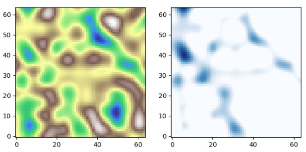

<!-- PROJECT LOGO -->
<br />
<div align="center">
    
  </a>

<h3 align="center">Floods 4</h3>

  <p align="center">
    The document serves to aid the visitor in understanding the content and purpose of this project. This project aims to use different implementations of neural networks as alternative to computationally expensive numerical models to predict the development of floods. To achieve this, the models are trained on numerical Delft3D simualations.
    <br />
    <a href="https://github.com/erikwu1220/DS-AI"><strong>Explore the docs »</strong></a>
    <br />
    <br />
    <a href="https://github.com/erikwu1220/DS-AI/blob/main/src/results/demo.ipynb">View Demo</a>

  </p>
</div>


<!-- TABLE OF CONTENTS -->
<details>
  <summary>Table of Contents</summary>
  <ol>
    <li>
      <a href="#about-the-project">About The Project</a>
      <ul>
        <li><a href="#built-with">Built With</a></li>
      </ul>
    </li>
    <li>
      <a href="#getting-started">Getting Started</a>
      <ul>
        <li><a href="#installation">Installation</a></li>
      </ul>
    </li>
    <li><a href="#usage">Usage</a></li>
    <li><a href="#contact">Contact</a></li>
    <li><a href="#acknowledgments">Acknowledgments</a></li>
  </ol>
</details>


<!-- ABOUT THE PROJECT -->
## About The Project
This project aims to use different implementations of neural networks as alternative to computationally expensive numerical models to predict the development of floods. To achieve this, the models are trained on numerical Delft3D simualations.


<p align="right">(<a href="#readme-top">back to top</a>)</p>


<!-- GETTING STARTED -->
## Getting Started

This is an example of how you may give instructions on setting up your project locally.
To get a local copy up and running follow these simple example steps.

### Installation

1. Clone the repo
   ```sh
   git clone https://github.com/erikwu1220/DS-AI
   ```
2. Install packages
   ```sh
    conda env create -f dsaie.yml
   ```

<p align="right">(<a href="#readme-top">back to top</a>)</p>


<!-- USAGE EXAMPLES -->
## Usage
A [demo]("https://github.com/erikwu1220/DS-AI/blob/main/src/results/demo.ipynb") notebook was created to get an idea of how models are applied. This notebook is also used in the project presentation.

[Training](https://github.com/erikwu1220/DS-AI/tree/main/src/training) is done in jupyter notebooks.

<p align="right">(<a href="#readme-top">back to top</a>)</p>


<!-- CONTACT -->
## Contact

Kevin de Bruijn - k.h.debruijn@student.tudelft.nl
Patrick de Bruijn - p.j.debruijn@student.tudelft.nl
Mats Kerver - m.r.kerver@student.tudelft.nl
Erik Wu - h.wu-28@student.tudelft.nl

Project Link: [https://github.com/erikwu1220/DS-AI](https://github.com/erikwu1220/DS-AI)

<p align="right">(<a href="#readme-top">back to top</a>)</p>


<!-- ACKNOWLEDGMENTS -->
## Acknowledgments

* [Roberto Bentivoglio](https://github.com/RBTV1/SWE-GNN-paper-repository-)
* [Read me template](https://github.com/othneildrew/Best-README-Template/blob/master/BLANK_README.md)
* [U-Net Pytorch implementation](https://github.com/milesial/Pytorch-UNet)
* [ConvLSTM (to be finished)](https://github.com/ndrplz/ConvLSTM_pytorch)


<p align="right">(<a href="#readme-top">back to top</a>)</p>

<!-- MARKDOWN LINKS & IMAGES -->
<!-- https://www.markdownguide.org/basic-syntax/#reference-style-links -->
[contributors-shield]: https://img.shields.io/github/contributors/github_username/repo_name.svg?style=for-the-badge
[contributors-url]: https://github.com/github_username/repo_name/graphs/contributors
[forks-shield]: https://img.shields.io/github/forks/github_username/repo_name.svg?style=for-the-badge
[forks-url]: https://github.com/github_username/repo_name/network/members
[stars-shield]: https://img.shields.io/github/stars/github_username/repo_name.svg?style=for-the-badge
[stars-url]: https://github.com/github_username/repo_name/stargazers
[issues-shield]: https://img.shields.io/github/issues/github_username/repo_name.svg?style=for-the-badge
[issues-url]: https://github.com/github_username/repo_name/issues
[license-shield]: https://img.shields.io/github/license/github_username/repo_name.svg?style=for-the-badge
[license-url]: https://github.com/github_username/repo_name/blob/master/LICENSE.txt
[linkedin-shield]: https://img.shields.io/badge/-LinkedIn-black.svg?style=for-the-badge&logo=linkedin&colorB=555
[linkedin-url]: https://linkedin.com/in/linkedin_username
[product-screenshot]: images/screenshot.png
[Next.js]: https://img.shields.io/badge/next.js-000000?style=for-the-badge&logo=nextdotjs&logoColor=white
[Next-url]: https://nextjs.org/
[React.js]: https://img.shields.io/badge/React-20232A?style=for-the-badge&logo=react&logoColor=61DAFB
[React-url]: https://reactjs.org/
[Vue.js]: https://img.shields.io/badge/Vue.js-35495E?style=for-the-badge&logo=vuedotjs&logoColor=4FC08D
[Vue-url]: https://vuejs.org/
[Angular.io]: https://img.shields.io/badge/Angular-DD0031?style=for-the-badge&logo=angular&logoColor=white
[Angular-url]: https://angular.io/
[Svelte.dev]: https://img.shields.io/badge/Svelte-4A4A55?style=for-the-badge&logo=svelte&logoColor=FF3E00
[Svelte-url]: https://svelte.dev/
[Laravel.com]: https://img.shields.io/badge/Laravel-FF2D20?style=for-the-badge&logo=laravel&logoColor=white
[Laravel-url]: https://laravel.com
[Bootstrap.com]: https://img.shields.io/badge/Bootstrap-563D7C?style=for-the-badge&logo=bootstrap&logoColor=white
[Bootstrap-url]: https://getbootstrap.com
[JQuery.com]: https://img.shields.io/badge/jQuery-0769AD?style=for-the-badge&logo=jquery&logoColor=white
[JQuery-url]: https://jquery.com 
